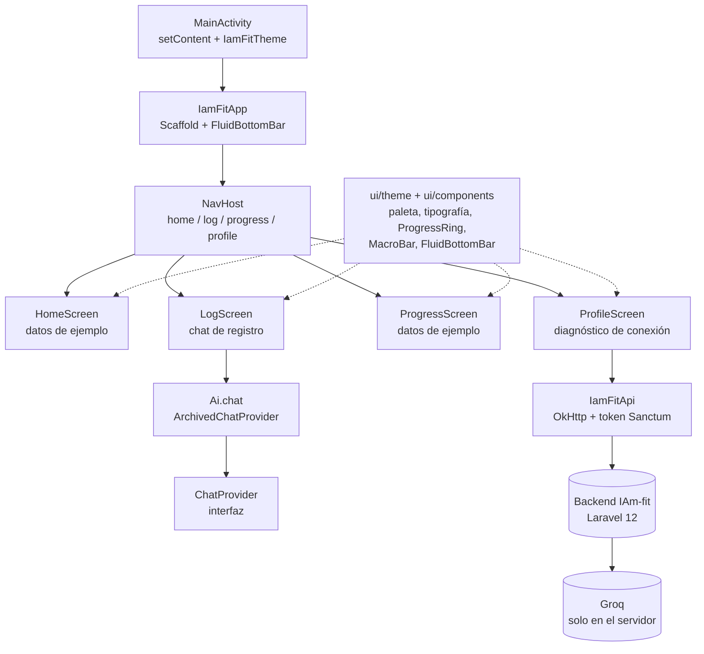

# IAm-fit

App Android para el seguimiento de nutrición y actividad física, con registro de
comidas y entrenamientos en lenguaje natural asistido por IA.

> **Estado: prototipo UI-first + backend real.** Las pantallas siguen mostrando
> datos de ejemplo y aún no hay persistencia local ni `ViewModel`, pero ya existe un
> backend Laravel 12 (repo `IAmFit`) que centraliza la IA. La
> app **ya no lleva la API key de Groq en el APK**: todas las llamadas de IA pasan
> por el backend (`/foods/search`, `/routines/{id}/advice`). El registro
> conversacional quedó archivado (decisión de producto B, 2026-10-02).

---

## Índice

- [Stack técnico](#stack-técnico)
- [Arquitectura](#arquitectura)
- [Estructura del proyecto](#estructura-del-proyecto)
- [Navegación y pantallas](#navegación-y-pantallas)
- [Módulo de IA](#módulo-de-ia)
- [Configuración](#configuración)
- [Compilar y ejecutar](#compilar-y-ejecutar)
- [Seguridad](#seguridad)
- [Limitaciones y roadmap](#limitaciones-y-roadmap)

---

## Stack técnico

| Área | Tecnología |
| --- | --- |
| Lenguaje | Kotlin 2.2.10 |
| UI | Jetpack Compose + Material 3 (Compose BOM 2026.02.01) |
| Navegación | `androidx.navigation:navigation-compose` 2.9.5 |
| Red | OkHttp 4.12.0 (+ `logging-interceptor`) |
| JSON | `kotlinx.serialization` 1.8.0 |
| Concurrencia | Coroutines (`Dispatchers.IO` para red) |
| Build | Gradle 9.3.1 (Kotlin DSL), AGP 9.1.1 |
| SDK | `minSdk 26`, `targetSdk 36`, `compileSdk 37` |
| Java | Compatibilidad de bytecode 11 |

Módulo único (`:app`), paquete `com.geeckosoft.iamfit`, versión `1.0` (`versionCode 1`).

---

## Arquitectura

La app es **UI-first**: no hay capa de dominio, repositorios ni base de datos. Toda la
información que se ve en pantalla vive en el estado de los composables (`remember` /
`mutableStateOf`) o es directamente constante de ejemplo. El único componente con
lógica real de negocio es el módulo de IA.



Principios aplicados en el código actual:

1. **La IA vive en el backend.** La app no conoce la key de Groq; consume la API del
   backend con `IamFitApi` (OkHttp + `kotlinx.serialization`). El registro
   conversacional quedó archivado y `Ai.chat` resuelve a un proveedor que lo indica.
2. **Errores con doble mensaje.** `AiException` separa el detalle técnico (`message`,
   para logs) del texto apto para el usuario (`userMessage`, para la UI).
3. **Tokens de diseño centralizados.** Colores, tipografía y formas viven en `ui/theme`;
   los componentes reutilizables en `ui/components`.

---

## Estructura del proyecto

```text
app/src/main/java/com/geeckosoft/iamfit/
├── MainActivity.kt              # Activity, tema, Scaffold y NavHost
├── ai/                          # Contrato de chat (feature archivado)
│   ├── Ai.kt                    # Singleton: proveedor de chat activo
│   ├── ChatProvider.kt          # Contrato + ChatResult
│   ├── ArchivedChatProvider.kt  # Registro conversacional archivado
│   └── AiException.kt           # Error técnico + mensaje de usuario
├── data/                        # Cliente de la API del backend
│   ├── IamFitApi.kt             # OkHttp + kotlinx.serialization + DTOs
│   └── TokenStore.kt            # Token Sanctum cifrado con Android Keystore
└── ui/
    ├── components/Components.kt # ProgressRing, MacroBar, FluidBottomBar, SectionTitle
    ├── screens/
    │   ├── home/HomeScreen.kt       # Resumen del día (calorías, macros, comidas)
    │   ├── log/LogScreen.kt         # Chat de registro con IA
    │   ├── progress/ProgressScreen.kt # Peso y racha semanal
    │   └── profile/ProfileScreen.kt   # Perfil + diagnóstico de conexión
    └── theme/                   # Color.kt, Theme.kt, Type.kt, Shape.kt
```

Archivos de configuración relevantes:

| Archivo | Contenido |
| --- | --- |
| `gradle/libs.versions.toml` | Catálogo de versiones y dependencias (version catalog) |
| `app/build.gradle.kts` | Configuración Android, `BuildConfig` y dependencias |
| `local.properties` | **No versionado.** Solo el SDK path (ya no guarda secretos) |
| `app/src/main/AndroidManifest.xml` | Permiso `INTERNET`, `MainActivity` como launcher |

---

## Navegación y pantallas

La navegación usa **Compose Navigation** con rutas de tipo `String`, definidas en
`MainActivity.kt`. La barra inferior (`FluidBottomBar`) es una píldora flotante con
indicador animado; al cambiar de pestaña se usa `saveState` / `restoreState` para
conservar el estado de cada pantalla.

| Ruta | Pestaña | Pantalla | Estado actual |
| --- | --- | --- | --- |
| `home` | Inicio | `HomeScreen` | Datos de ejemplo: 1120/2200 kcal, macros y 3 comidas |
| `log` | Registrar | `LogScreen` | Chat archivado: informa que use el diario/búsqueda de alimentos |
| `progress` | Progreso | `ProgressScreen` | Datos de ejemplo: pesos de la semana y racha |
| `profile` | Perfil | `ProfileScreen` | Perfil de ejemplo + "Probar conexión" contra `GET /api/health` |

Transiciones entre pantallas: `fadeIn(220ms)` / `fadeOut(140ms)`.

`ProfileScreen` incluye además un bloque de **Diagnóstico** que muestra la URL del
backend (`BuildConfig.API_BASE_URL`) y permite hacer un ping a `GET /api/health`.

---

## Módulo de IA

La IA ya no se ejecuta en el cliente. La app consume la API del backend
(repo `IAmFit`) con `IamFitApi`:

| Feature | Endpoint | Dónde corre la IA |
| --- | --- | --- |
| Enriquecimiento de alimentos | `GET /api/foods/search` + `GET /api/foods/lookups/{id}` | Backend (`ResolveFoodLookup`: Open Food Facts → USDA → IA) |
| Consejo de cargas de rutina | `POST /api/routines/{id}/advice` | Backend (`TrainingAdviceService`) |
| Salud del backend | `GET /api/health` | — |
| Diagnóstico de IA | `POST /api/diagnostics/ai` | Backend (ping a Groq) |

`IamFitApi` (`data/IamFitApi.kt`) usa OkHttp + `kotlinx.serialization`, con timeouts
de 15/30/45 s. Adjunta `Authorization: Bearer <token>` desde `TokenStore` y traduce
los errores a `ApiException` con un mensaje seguro para la UI.

`TokenStore` (`data/TokenStore.kt`) cifra el token de Sanctum con una llave AES del
Android Keystore (AES/GCM, IV aleatorio por escritura) y lo guarda en
`SharedPreferences`; la llave nunca sale del Keystore.

### Registro conversacional (archivado)

El contrato `ChatProvider` se conserva, pero `Ai.chat` resuelve a
`ArchivedChatProvider`, que informa que el registro por chat quedó descontinuado.
`LogScreen` lo muestra como una burbuja. La UX de reemplazo (diario vs. búsqueda de
alimentos) se define aparte.

### Configuración de red

La URL del backend es un `BuildConfig` no secreto:

```kotlin
buildConfigField("String", "API_BASE_URL", "\"http://10.0.2.2:8001/api/\"")
```

`10.0.2.2` es el alias del host visto desde el emulador. El tráfico HTTP en claro
solo está permitido en debug (`app/src/debug/AndroidManifest.xml`); en release se
exige HTTPS.

**No hay secretos de IA en el proyecto Android.** `local.properties` solo contiene
el SDK path.

---

## Compilar y ejecutar

Requisitos: **JDK 17 o superior** para ejecutar Gradle (el proyecto se compila con el
JBR 21 de Android Studio; el bytecode se genera con compatibilidad Java 11) y el
Android SDK apuntado desde `local.properties`.

```bash
# Compilar APK de debug
./gradlew assembleDebug

# Ejecutar tests unitarios
./gradlew testDebugUnitTest

# Ejecutar lint
./gradlew lintDebug

# Instalar en un dispositivo/emulador conectado
./gradlew installDebug
```

Si el JDK del sistema no coincide, puede forzarse el de Android Studio:

```bash
JAVA_HOME=/ruta/a/android-studio/jbr ./gradlew assembleDebug
```

---

## Seguridad

| Riesgo | Situación actual |
| --- | --- |
| API key de Groq en el APK | **Resuelto:** la key vive solo en el `.env` del backend; el APK no contiene ninguna referencia a Groq |
| Token de Sanctum | Cifrado con Android Keystore (AES/GCM); `logout()` lo borra |
| Logging HTTP | `HttpLoggingInterceptor` en nivel `BASIC` **solo en debug** (no registra headers) |
| Tráfico en claro | Solo en debug hacia `10.0.2.2`; release exige HTTPS |
| Secretos en control de versiones | `local.properties` está en `.gitignore` y ya no contiene secretos |

---

## Limitaciones y roadmap

**Limitaciones actuales**

- Sin persistencia local: comidas, pesos, macros y perfil siguen siendo datos de
  ejemplo en memoria.
- `IamFitApi` existe, pero las pantallas aún no están conectadas a `/energy`,
  `/diary`, `/profile`, `/weight`, `/routines`, etc.
- Sin `ViewModel` ni capa de repositorios; el estado vive en los composables y se
  pierde al recrear la Activity.
- Sin flujo de login/registro en la UI (el token se guarda vía `TokenStore`, pero
  nadie lo crea todavía).
- El chat de registro quedó archivado; falta decidir su reemplazo en la UX.
- Los tests son los de plantilla (`ExampleUnitTest`, `ExampleInstrumentedTest`).

**Siguientes pasos sugeridos**

1. Añadir login/registro contra el backend y guardar el token con `TokenStore`.
2. Conectar `HomeScreen` a `/energy` + `/diary` y `ProgressScreen` a `/weight` +
   `/progress/streak`.
3. Sustituir los datos de ejemplo por `ViewModel` + repositorios (Room/DataStore).
4. Reemplazar el chat archivado por el flujo de diario/búsqueda de alimentos.
5. Añadir tests de UI/unitarios sobre `IamFitApi` y los flujos de registro.

---

## Notas de origen

El contrato `ChatProvider` nació como adaptación del patrón usado en otro proyecto
de un proyecto hermano. Tras la decisión B, la ejecución de IA se movió al backend Laravel 12
y el cliente solo consume su API.
